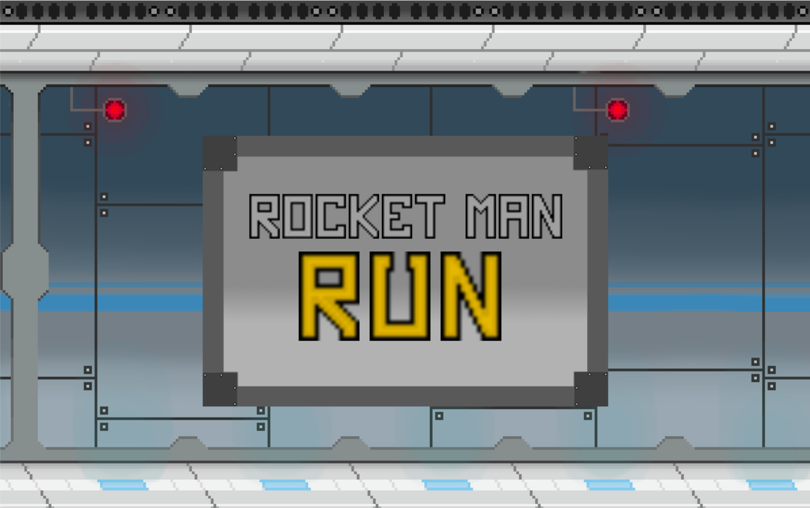

# Rocketman-Run
My second project. This project is a clone of the world renowned mobile game Jetpack Joyride made in python using the pygame library. All the assets for the game were inspired by the original game but were made by me using paint.net. Curently, there is only one background, the lab, and one obstacle type, the lasers.

